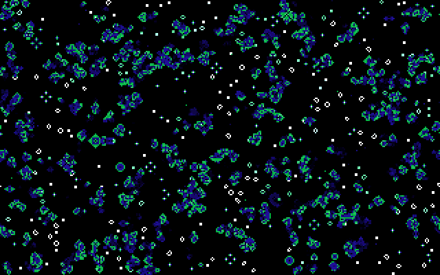

<div align="center">
<h1>BootLife</h1>
<p><b>Conway's Game of Life running directly from a 512-byte x86 boot sector, using VGA memory as the simulation grid.</b></p>

[Usage](#usage) • [Why](#why) • [Contributing](#contributing) • [Author](#author)



</div>

## Usage

To build and run `bootlife` you need:

- [NASM](https://www.nasm.us/)
- [QEMU](https://www.qemu.org/)

Use the following commands to run it:

```bash
nasm -f bin -o life.img life.asm

qemu-system-i386 -drive file=life.img,format=raw,if=floppy
```

Or just:

```bash
make run
```

## Why

Just for fun 💾

## Contributing

Bug reports and pull requests are welcome - see [CONTRIBUTING.md](./CONTRIBUTING.md).

## Author

[0xAX](https://x.com/0xAX)
