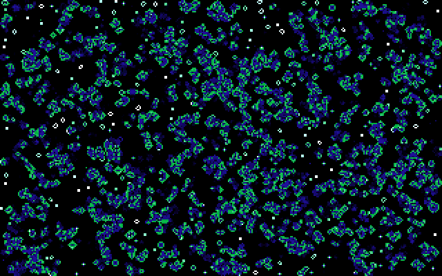

# BootLife — optimized variants

A tested set of optimization experiments based on [Alex Kuleshov’s BootLife](https://github.com/0xAX/BootLife).
The original program is preserved as [`life.asm`](life.asm), with its ISC license.
The alternatives explore sliding windows, three-row buffering, lookup tables,
and paired VGA writes while keeping the complete boot image at **512 bytes**.

**[Read the article](ARTICLE.md)** · **[Final sources and images](final/README.md)** ·
**[Download the verified release](https://github.com/dmytro-yemelianov/BootLife-optimized/releases/tag/v2026.09.25)** ·
**[Timing methodology](LATENCY.md)**



## Choose a version

| Priority | Variant | Payload bytes | Work RAM bytes | Seconds/generation¹ |
|---|---|---:|---:|---:|
| Smallest finite-grid payload | [sliding](final/life.sliding.asm) | 408 | 65,536 | 0.001029 |
| Preferred low-RAM choice | [rolling_sliding](final/life.rolling_sliding.asm) | 467 | 966 | 0.001310 |
| Low-RAM color table | [rolling_lut](final/life.rolling_lut.asm) | 490 | 3,526 | 0.001133 |
| Fast table with smaller payload | [sliding_lut](final/life.sliding_lut.asm) | 431 | 68,096 | 0.000875 |
| Fastest observed kernel | [sliding_lut_word](final/life.sliding_lut_word.asm) | 473 | 68,096 | 0.000779 |
| Embedded bit-table demonstration | [rolling_bits](final/life.rolling_bits.asm) | 510 | 966 | 0.001365 |

¹ Corrected, unpaced QEMU 11.0.1 / single-thread TCG measurements on Apple M5,
using a Pentium instruction-set model. Seven samples, 20 generations per sample;
all timed output bytes checked. These are **not physical Pentium timings**.
The regular demo retains BIOS pacing: approximately **18.2 FPS** in the tested
seeded runs. Payload excludes padding and the signature; every `.img` is 512 bytes.

The alternatives use finite dead borders and restrict glider origins to fit
within a row. This deliberately changes the original program’s row-seam behavior.
The palette, byte aging/fading, random sparks, gliders, and timer pacing remain.

## Run or build

With QEMU installed, run a supplied image:

```sh
qemu-system-i386 -cpu pentium -drive file=final/rolling_sliding.img,format=raw,if=floppy
```

With NASM and Make installed:

```sh
make                          # build/rolling_sliding.img
make run                      # run the default low-RAM version
make run VARIANT=sliding_lut_word
make upstream                 # build/upstream.img from the unchanged original
```

Each source in `final/` is standalone:

```sh
nasm -f bin -o life.img final/life.sliding_lut_word.asm
```

Defaults use `RDTSC` for seeding. `-DSEED=0x1234` removes that instruction;
the code still uses 386-era instructions and segment registers. Use
`-DSPARKS=0 -DGLIDERS=0` to disable injections. These production images retain
timer pacing; the measurement observers are separate.

## Verify and reproduce

Python 3.10+ and NASM are required for checksum/rebuild verification. QEMU is
also required for the actual BIOS-booted machine-code suite.

```sh
python3 verify_release.py       # file checksums and 24 exact production rebuilds
make check PYTHON=python3       # five generations, all six delivered alternatives
```

The checks cover all framebuffer bytes, finite edges, RAM guards and halos,
cache contents, seeded injections, glider placement boundaries, generated tables,
and boot/pacing behavior. [Clean-copy results](results/release.checks.json) and
[rebuild verification](results/release-verification.json) are included.
For full timing and startup commands, see [LATENCY.md](LATENCY.md).

Earlier benchmark results were distorted by a breakpoint on the boot-code page.
The corrected harness stops on a separate page. The article explains the A/B
experiment and the resulting change in rankings; historical raw reports remain
available and are explicitly marked as superseded.

## Contents and upstream review

- [ARTICLE.md](ARTICLE.md): the complete optimization article, including unsuccessful experiments and the timing correction.
- [final/](final/): six standalone NASM sources, matching images, and a configuration manifest.
- [experiment.py](experiment.py), [measure_latency.py](measure_latency.py), and [check_palette.py](check_palette.py): reproducible machine-code checks and measurements.
- [results/](results/): raw evidence and checksums; historical absolute paths identify the original runs and are not runtime dependencies.
- [EXPERIMENT_HISTORY.md](EXPERIMENT_HISTORY.md): detailed experiment history.
- [CONTRIBUTION_NOTES.md](CONTRIBUTION_NOTES.md): review scope and upstream contribution preparation.

Base: upstream commit `86dc8d932db282097fd157e2c65051af7a3dd118`.
Original copyright and [ISC license](LICENSE) are retained. This is an
independent optimization fork, not an upstream-endorsed replacement. Boundary
behavior and the preferred code/RAM tradeoff should be agreed before proposing
a focused upstream change.
